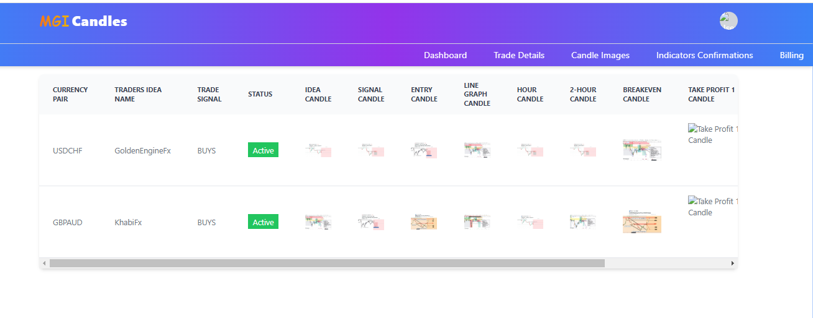
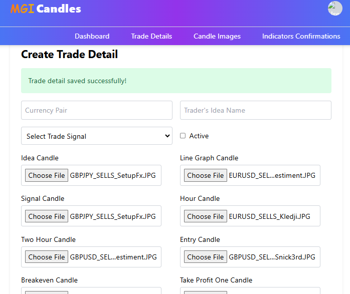
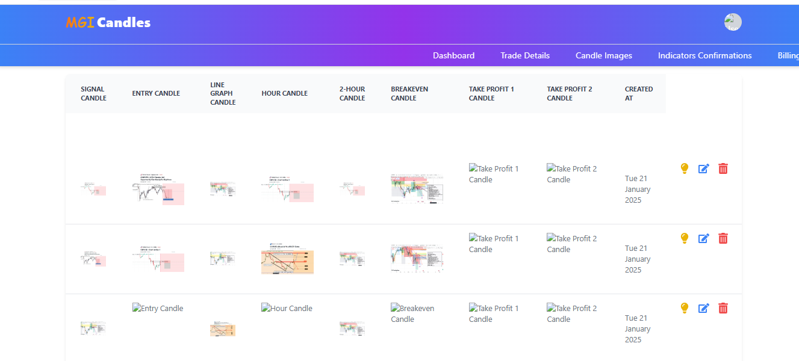
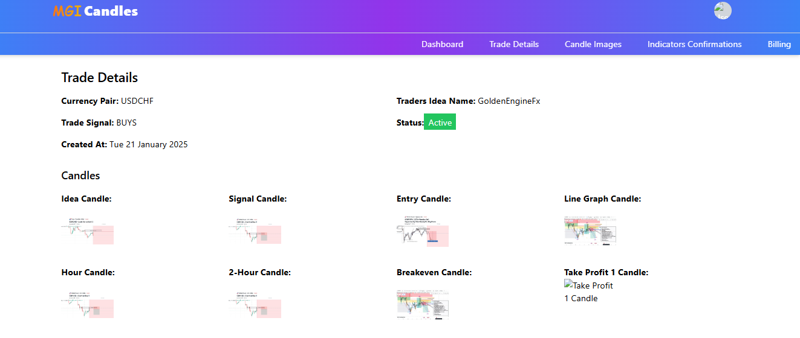

# This is react and tailwind application that fetched data from django application and views them in table fomart

# Dashboard Overview plan

# Can Read data from the database 

# I have created Component to save data for TradingDetails Component

# CRUD buttons 

# Single Item data

trade-app/
├── public/
│   ├── index.html
│   └── ...
├── src/
│   ├── components/
│   │   ├── Auth/
│   │   │   ├── LoginForm.js
│   │   │   └── RegisterForm.js
│   │   ├── Trade/
│   │   │   ├── TradeDetails.js
│   │   │   ├── TradeForm.js
│   │   │   ├── TradeUpdateForm.js
│   │   │   └── TradeView.js
│   │   └── Navbar.js
│   ├── redux/
│   │   ├── authSlice.js
│   │   ├── tradeSlice.js
│   │   └── store.js
│   ├── api/
│   │   ├── api.js                # Axios instance or API functions
│   │   └── tradeService.js       # Service file for CRUD operations
│   ├── App.js
│   ├── index.js
│   └── styles/
│       └── App.css
├── .gitignore
├── package.json
└── README.md