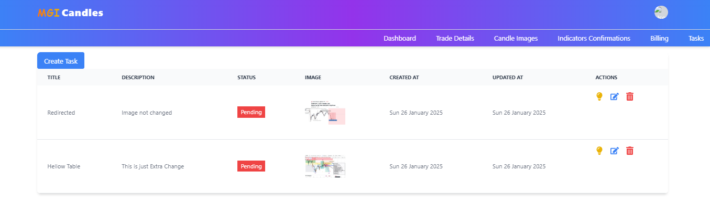
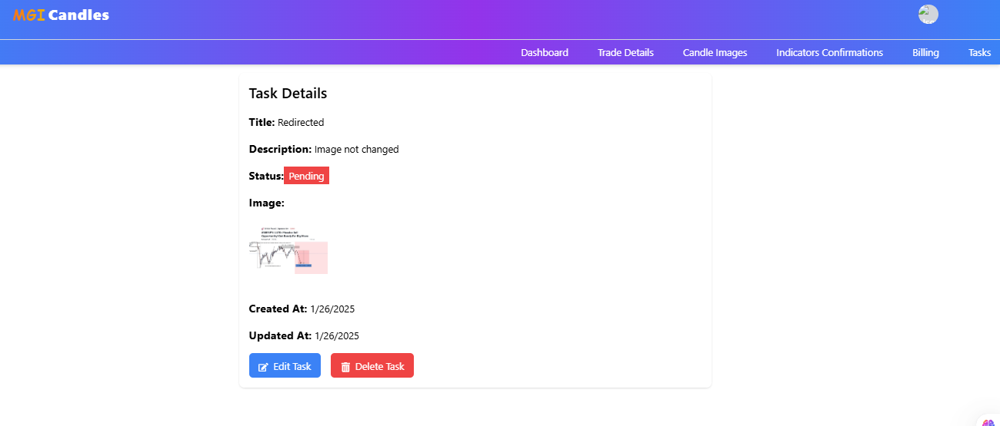
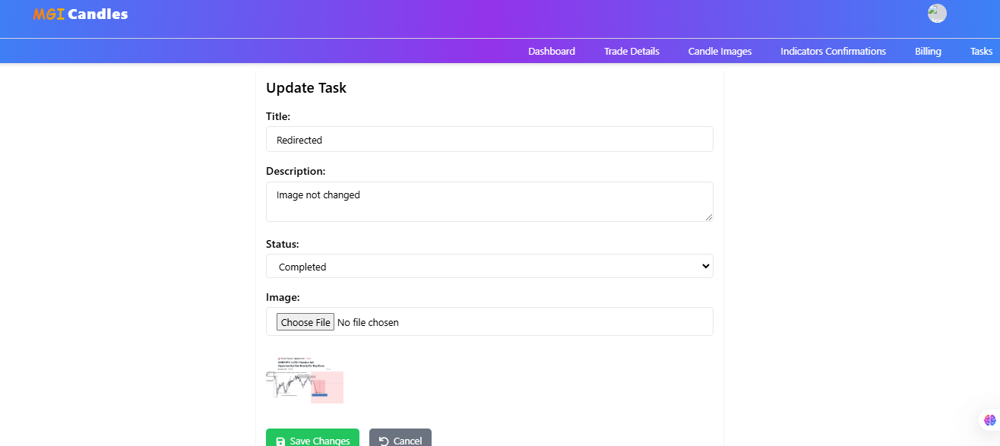
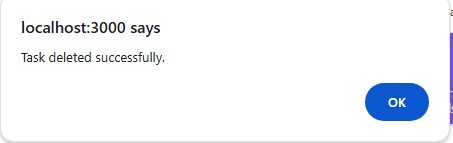

# This is react and tailwind application that fetched data from django application and views them in table fomart

# CRUD OPERATIONS COMPLETE FOR TASKS APP starting with READ

# View single item

# Update 

# Delete
