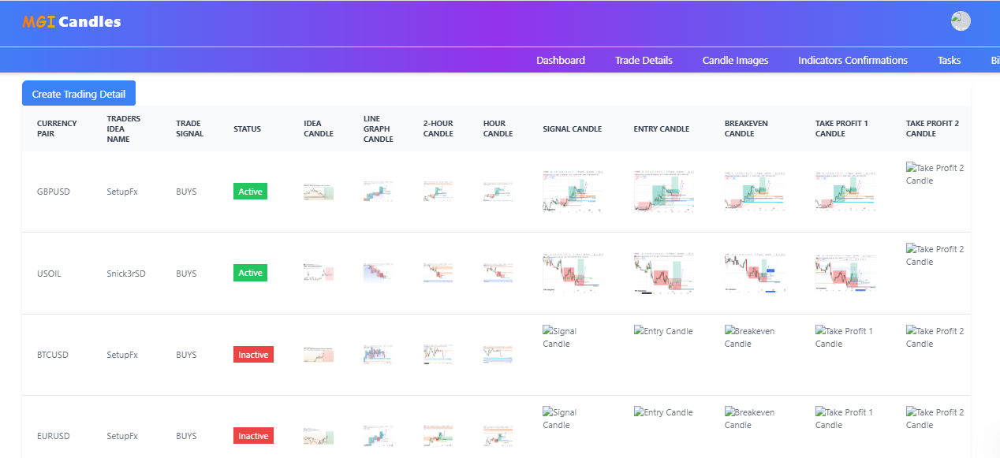
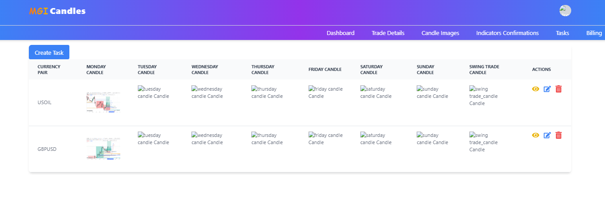
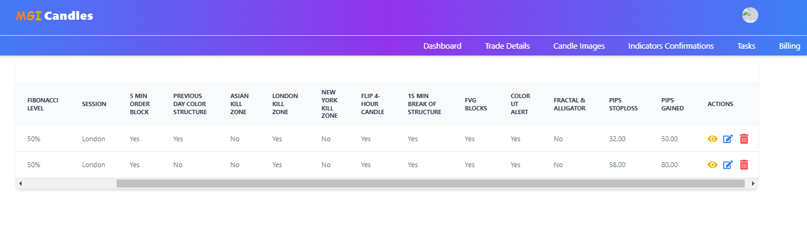
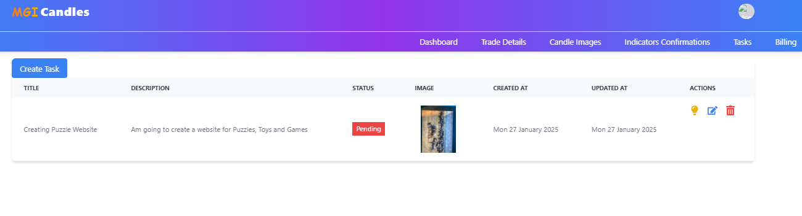

# This is react and tailwind application that fetched data from django application and views them in table fomart

# Dashboard Overview plan

# Can Read data from the database 

# I have created Component to save data for TradingDetails Component

# CRUD buttons 

# Single Item data
